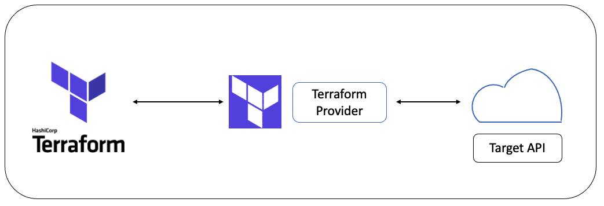

# Terraform là gì ? 

Terraform là một công cụ Infrastructure as Code (IaC) cho phép bạn triển khai tài nguyên một cách an toàn và hiệu quả. Các tài nguyên này được định nghĩa trong các tệp cấu hình có thể đọc được bởi con người, cho phép quản lý version, tái sử dụng và chia sẻ. Terraform tương tác với các nền tảng đám mây và các dịch vụ khác thông qua API của họ để tạo và quản lý tài nguyên. Terraform cung cấp cho các nhà phát triển khả năng thiết kế và triển khai hạ tầng một cách đáng tin cậy, có thể tái tạo và tự động hóa quy trình triển khai nhiều lần.




# Chuẩn bị

Bạn sẽ cần các thành phần sau trong môi trường phát triển local:

- Một IDE tùy chọn của bạn (ví dụ: VSCode)
- Tài khoản AWS với người dùng/role IAM có quyền "AdministratorAccess" (Lưu ý: quyền này chỉ nên sử dụng để hoàn thành workshop này)
  - Nếu bạn sử dụng máy tính local của mình, bạn sẽ cần tạo người dùng IAM và tạo key truy cập IAM. Bạn có thể làm theo hướng dẫn [Managing access keys](https://docs.aws.amazon.com/IAM/latest/UserGuide/id_credentials_access-keys.html#Using_CreateAccessKey) để tạo key truy cập IAM từ người dùng IAM của bạn.
  - Nếu bạn đã triển khai IDE của mình trên một instance EC2, bạn có thể sử dụng IAM role. Tham khảo tài liệu "IAM roles for Amazon EC2" để biết chi tiết.
- Terraform đã được cài đặt trên môi trường phát triển local của bạn. Nếu bạn chưa cài Terraform, bạn có thể làm theo hướng dẫn chính thức của [Terraform](https://developer.hashicorp.com/terraform/tutorials/aws-get-started/install-cli) từ Hashicorp để cài đặt.

Sau khi có được các thành phần phía trên, cần thực hiện thêm một số bước sau để hoàn tất môi trường phát triển: 

- Trên terminal của bạn, làm theo hướng dẫn Configure the AWS CLI để thiết lập các biến môi trường AWS CLI dựa trên môi trường của bạn.

- Tải về file zip sau: [terraform.zip](https://static.us-east-1.prod.workshops.aws/public/3a811ff3-2be5-4d8f-80a8-85b21ca5b5e4/assets/terraform.zip) vào thư mục tải xuống trên máy của bạn.

- Trên máy local, giải nén thư mục và mở nó trong IDE của bạn.

Như vậy là đã hoàn tất môi trường để thử nghiệm với Terraform. Bạn sẽ sử dụng thư mục này trong toàn bộ workshop.


# Một số kiến thức cơ bản về Terraform 

Trước khi đi sâu vào workshop, chúng ta sẽ bắt đầu bằng việc tìm hiểu các khái niệm cốt lõi của Terraform (providers, modules, và states) và xem qua tổng quan về workshop. Các chủ đề được đề cập trong phần này bao gồm:

- Kiến thức cơ bản về Terraform
- Cấu trúc thư mục
- Local values
- Input variables
- Output values
- Providers
- Resources
- Data sources
- Quản lý trạng thái (State management)
- Tài liệu Terraform (Terraform documentation)

## Cấu trúc thư mục

Một thư mục điển hình sẽ chứa các tệp `main.tf`, `outputs.tf`, `providers.tf`, và `variables.tf`, trong đó:

- `main.tf` chứa các tài nguyên cốt lõi của module.
- `outputs.tf` (Optional) chứa các giá trị đầu ra của module.
- `variables.tf` (Optional) chứa các biến đầu vào của module.
- `providers.tf` (Optional) chứa cấu hình provider, sẽ được đề cập sau.

Ví dụ: Cấu trúc thư mục Terraform:

``` bash
    terraform-test
    ├── main.tf
    ├── outputs.tf
    ├── providers.tf
    └── variables.tf
```

## Variables and Outputs

### Local values 

- Local values là các giá trị có tên được gán và có thể được sử dụng trong toàn bộ mã của bạn. 
- Local values có thể là hằng số hoặc giá trị tham chiếu. 
- Local values được gán bằng cách tạo một khối locals như dưới đây:

    ``` bash

    locals {
    # Gán giá trị 'dev' cho environment
    instance_name = "dev-instance"

    # Lấy instance ID của EC2 instance 'app_server'
    instance_id   = aws_instance.app_server.id
    }

    ```


- Để sử dụng local variables, cú pháp là local.<variable_name>. Đây là một ví dụ sử dụng local variable để đặt tên cho tài nguyên EC2 instance.

### Input variables

- Input variables được sử dụng để cung cấp các tham số cho bạn tùy chỉnh module Terraform mà không cần thay đổi mã nguồn của module, tránh việc hard-code giá trị và cho phép tái sử dụng mã.

- Ví dụ về input variables:

    ``` bash
    variable "app_name" {
    type        = string
    description = "Tên của ứng dụng"
    default     = ""
    }
    ```

- Để sử dụng input variables, cú pháp là var.<variable_name>. Đây là ví dụ sử dụng input variable để đặt tên cho tài nguyên EC2 instance:

    ``` bash
    resource "aws_instance" "app_server" {
    # ...

    tags = {
        # Sử dụng input variable
        Name = var.app_name,
        "Environment" = "prod"
    }
    }
    ```
- Bạn cũng có thể gán biến từ dòng lệnh:

    ``` bash
    terraform apply -var="app_name=wordpress-app"
    ```

### Output variables 

- Output variables cho phép bạn xuất thông tin về các tài nguyên để các cấu hình Terraform khác có thể sử dụng.

    ``` bash
    output "instance_tags" {
    value       = aws_instance.this_server.tags
    description = "Mapping của các thẻ EC2 instance"
    }
    ```

## Providers, Resources, và Data Sources

### Providers 

- Providers cung cấp khả năng tương tác với các nhà cung cấp dịch vụ đám mây, các nhà cung cấp phần mềm dưới dạng dịch vụ (SaaS), và các API khác. Mỗi provider cung cấp một tập hợp các tài nguyên (resources) và nguồn dữ liệu (data sources) mà Terraform có thể quản lý.

- Ví dụ về AWS provider:

    ``` bash
    provider "aws" {
    region = "us-east-1"
    }
    ```

### Resources

- Resources là yếu tố cốt lõi trong Terraform. Khi khai báo một resource, bạn có thể định nghĩa một hoặc nhiều đối tượng tài nguyên hạ tầng như tính toán (compute), mạng (networking), v.v.

- Ví dụ về resource của AWS Simple Storage Service (S3) bucket:
    ``` bash
    resource "aws_s3_bucket" "example" {
    bucket = "my-tf-test-bucket"    
    }
    ```

### Data sources

- Data Sources cho phép truy vấn các tài nguyên đã được định nghĩa bên ngoài Terraform và cung cấp các thuộc tính tìm thấy trong tài nguyên đó.

- Ví dụ về truy vấn dữ liệu của một AWS Virtual Private Cloud (VPC) hiện có:

    ``` bash
    data "aws_vpc" "selected" {
    id = "vpc-00f0b02721857a89d"
    }
    ```

## Quản lý trạng thái (State management)

- Terraform lưu trữ thông tin về hạ tầng của bạn trong một tệp trạng thái (state file), thường có tên là `terraform.tfstate`. Terraform sử dụng trạng thái này để xác định những thay đổi cần thực hiện cho hạ tầng của bạn như sửa đổi, thêm hoặc xóa. Trước khi thực hiện bất kỳ thao tác nào, Terraform sẽ làm mới (refresh) để đồng bộ cấu hình hiện tại của tài nguyên và kiểm tra sự khác biệt

- Các tệp trạng thái được lưu trữ dưới dạng JavaScript Object Notation (JSON). Dưới đây là ví dụ về tệp trạng thái của việc triển khai một tài nguyên VPC với một số nguồn dữ liệu tại vùng us-west-2.

    ``` bash
    {
    "version": 4,
    "terraform_version": "1.4.6",
    "serial": 133,
    "lineage": "cb58f73d-003f-5734-7872-6019650d0d41",
    "outputs": {},
    "resources": [
        {
        "mode": "data",
        "type": "aws_availability_zones",
        "name": "available",
        "provider": "provider[\"registry.terraform.io/hashicorp/aws\"]",
        "instances": [
            {
            "schema_version": 0,
            "attributes": {
                "all_availability_zones": null,
                "exclude_names": null,
                "exclude_zone_ids": null,
                "filter": null,
                "group_names": [
                "us-west-2"
                ],
                "id": "us-west-2",
                "names": [
                "us-west-2a",
                "us-west-2b",
                "us-west-2c",
                "us-west-2d"
                ],
                "state": "available",
                "timeouts": null,
                "zone_ids": [
                "usw2-az2",
                "usw2-az1",
                "usw2-az3",
                "usw2-az4"
                ]
            },
            "sensitive_attributes": []
            }
        ]
        },
        {
        "mode": "data",
        "type": "aws_region",
        "name": "current",
        "provider": "provider[\"registry.terraform.io/hashicorp/aws\"]",
        "instances": [
            {
            "schema_version": 0,
            "attributes": {
                "description": "US West (Oregon)",
                "endpoint": "ec2.us-west-2.amazonaws.com",
                "id": "us-west-2",
                "name": "us-west-2"
            },
            "sensitive_attributes": []
            }
        ]
        },
        {
        "mode": "managed",
        "type": "aws_vpc",
        "name": "default",
        "provider": "provider[\"registry.terraform.io/hashicorp/aws\"]",
        "instances": [
            {
            "schema_version": 1,
            "attributes": {
                "arn": "arn:aws:ec2:us-west-2:000000000000:vpc/vpc-00f0b02721857a89d",
                "assign_generated_ipv6_cidr_block": false,
                "cidr_block": "10.0.0.0/16",
                "default_network_acl_id": "acl-09dcdd87a8f96ba42",
                "default_route_table_id": "rtb-059654c5165723557",
                "default_security_group_id": "sg-0e43a7c421cc6f39d",
                "dhcp_options_id": "dopt-0869880b486ae393b",
                "enable_dns_hostnames": true,
                "enable_dns_support": true,
                "enable_network_address_usage_metrics": false,
                "id": "vpc-00f0b02721857a89d",
                "instance_tenancy": "default",
                "ipv4_ipam_pool_id": null,
                "ipv4_netmask_length": null,
                "ipv6_association_id": "",
                "ipv6_cidr_block": "",
                "ipv6_cidr_block_network_border_group": "",
                "ipv6_ipam_pool_id": "",
                "ipv6_netmask_length": 0,
                "main_route_table_id": "rtb-059654c5165723557",
                "owner_id": "000000000000",
                "tags": {
                "Name": "terraform-workshop-vpc"
                },
                "tags_all": {
                "Management": "Terraform",
                "Name": "terraform-workshop-vpc"
                }
            },
            "sensitive_attributes": [],
            "private": "eyJzY2hlbWFfdmVyc2lvbiI6IjEifQ==",
            "dependencies": [
                "data.aws_availability_zones.available"
            ]
            }
        ]
        }
    ],
    "check_results": null
    }

    ```

## Terraform CLI

- Terraform cung cấp một giao diện dòng lệnh (CLI) có thể được gọi bằng lệnh terraform sau khi bạn đã cài đặt Terraform trên hệ thống của mình.

- Các lệnh chính trong Terraform CLI bao gồm:
  
    + `terraform init`: khởi tạo thư mục làm việc của Terraform. Đây là lệnh đầu tiên bạn chạy khi viết một cấu hình Terraform mới hoặc khi bạn clone một cấu hình từ repository, vì nó thực hiện nhiều bước khởi tạo để chuẩn bị thư mục làm việc hiện tại cho Terraform.


    + `terraform validate`: kiểm tra cấu hình Terraform trong thư mục làm việc để đảm bảo rằng nó hợp lệ về mặt cú pháp, nhưng không kiểm tra các dịch vụ từ xa như remote state hoặc API của provider. Lệnh này thường được sử dụng để xác thực các module tái sử dụng và đảm bảo rằng tên thuộc tính và kiểu giá trị là chính xác.
  
    + `terraform plan`:  tạo một kế hoạch thực thi, cung cấp cho bạn bản xem trước những thay đổi sẽ được thực hiện trên hạ tầng (ví dụ: tài nguyên nào sẽ được tạo, xóa, hoặc sửa đổi). Nếu không có thay đổi nào cần thực hiện, Terraform sẽ báo cáo rằng không có thay đổi.

    + `terraform apply`: thực hiện các hành động đã được đề xuất từ kế hoạch (plan) của Terraform. Thực tiễn tốt nhất là sử dụng terraform validate và terraform plan trước khi chạy lệnh này để đảm bảo rằng bạn đang triển khai tài nguyên một cách chính xác qua Terraform như dự định. Với lệnh terraform apply, nó sẽ tự động thực thi terraform plan nếu không có kế hoạch nào được cung cấp.

    + `terraform destroy`: xóa tất cả các tài nguyên từ xa được quản lý bởi cấu hình Terraform trong thư mục làm việc hiện tại. Lưu ý rằng nếu tài nguyên được tạo bên ngoài cấu hình Terraform cụ thể, nó sẽ không bị xóa.

## Terraform Documentation

- Bạn có thể tìm hiểu ở đường dẫn [Terraform Document](https://developer.hashicorp.com/terraform/docs)


# Thử nghiệm sử dụng Terraform

## 1. Cài đặt terraform

- Đối với hệ điều hành ubuntu: 

    ``` bash
    wget https://releases.hashicorp.com/terraform/1.5.4/terraform_1.5.4_linux_amd64.zip
    unzip terraform_1.5.4_linux_amd64.zip
    sudo mv terraform /usr/local/bin/
    ```

- Kiểm tra lại version: 

    ``` bash
    vinh@vinh:~/Desktop/aws/terraform$ terraform --version
    Terraform v1.5.4
    on linux_amd64

    Your version of Terraform is out of date! The latest version
    is 1.9.5. You can update by downloading from https://www.terraform.io/downloads.html
    ```

## 2. Tạo 1 dự án terraform 

- Chạy câu lệnh sau: 

    ``` bash
        mkdir terraform-ec2
        cd terraform-ec2
    ```

## 3. Viết cấu hình terraform 

- Tạo 1 file `main.tf`: 

    ``` bash
    provider "aws" {
    region = "us-east-1"  # Khu vực N. Virginia
    }

    resource "aws_instance" "example" {
    ami           = "ami-0c55b159cbfafe1f0"  # AMI phù hợp cho us-east-1
    instance_type = "t2.micro"

    tags = {
        Name = "Terraform EC2"
    }
    }
    ```

## 4. Thực hiện config cấu hình AWS

- Đảm bảo rằng bạn đã cấu hình các thông tin xác thực của AWS như AWS_ACCESS_KEY_ID và AWS_SECRET_ACCESS_KEY. Bạn có thể cấu hình chúng thông qua:

    ``` bash
    aws configure
    ```

## 5. Thực hiện chạy terraform 

- Chạy các lệnh sau: 

    ``` bash
        terraform init
        terraform plan
        terraform apply
    ```


- Log khi thực hiện tạo thành công: 

``` bash
  Enter a value: yes

    aws_instance.my_free_tier_instance: Creating...
    aws_instance.my_free_tier_instance: Still creating... [10s elapsed]
    aws_instance.my_free_tier_instance: Creation complete after 17s [id=i-0a5b69861a3ed5503]

    Apply complete! Resources: 1 added, 0 changed, 0 destroyed.
```
